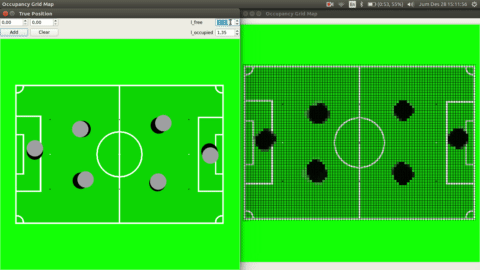

## Robosoccer Occupancy Grid Map
This repo shows my implementation (within robosoccer context) of Occupancy Grid Mapping algorithm as described by Sebastian Thrun *et al.* in 

> Thrun, Sebastian, Wolfram Burgard, and Dieter Fox. *Probabilistic Robotics*. MIT Press, 2005.

### Demo
   
   
click any [of](https://www.youtube.com/watch?v=3Is-m4kjH-Y) [this](https://www.youtube.com/watch?v=vDWKjYsMWv4) [link](https://www.youtube.com/watch?v=xpIxKY8aeac) to watch full videos.

### You'll Need :
  * c++
  * Qt 

### Building
  * from terminal :   
`mkdir -p build`   
`qmake ..`   
`make -j4`   
  * from QtCreator GUI (recommended)

#### tested on
  * Ubuntu 16.04 (intel i3 @ 2 GHz)
  * Qt 5.7
  * gcc 7.4